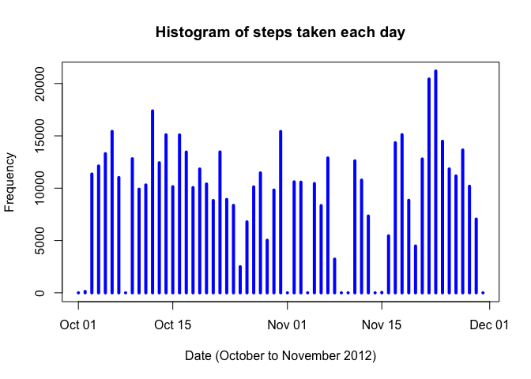

# Reproducible Research: Peer Assessment 1
Loading a few libraries

```r
library(plyr)
library(dplyr)
```

```
## 
## Attaching package: 'dplyr'
```

```
## The following objects are masked from 'package:plyr':
## 
##     arrange, count, desc, failwith, id, mutate, rename, summarise,
##     summarize
```

```
## The following objects are masked from 'package:stats':
## 
##     filter, lag
```

```
## The following objects are masked from 'package:base':
## 
##     intersect, setdiff, setequal, union
```

```r
library(ggplot2)
library(data.table)
```

```
## -------------------------------------------------------------------------
```

```
## data.table + dplyr code now lives in dtplyr.
## Please library(dtplyr)!
```

```
## -------------------------------------------------------------------------
```

```
## 
## Attaching package: 'data.table'
```

```
## The following objects are masked from 'package:dplyr':
## 
##     between, last
```

## Loading and preprocessing the data
Load the **activity.csv** file and convert the dates to Date class

```r
activityDataset <- read.csv(file = "activity.csv", header = TRUE, sep = ",")
activityDataset$date <- as.Date(activityDataset$date, "%Y-%m-%d")
```


## What is mean total number of steps taken per day?
1. Calculate the sum aggregation of steps taken by day, ignoring NAs
2. Plot the histogram based on the previous aggregation
3. Calculate and report the mean and median of the total number of steps taken per day

```r
totalStepsPerDay <- with(activityDataset, aggregate(steps, by = list(date), sum, na.rm=TRUE))
plot(totalStepsPerDay, type="h", main="Histogram of steps taken each day", xlab="Date (October to November 2012)", ylab="Frequency", lwd=4, col="blue")
```

<!-- -->


## What is the average daily activity pattern?


## Imputing missing values


## Are there differences in activity patterns between weekdays and weekends?
