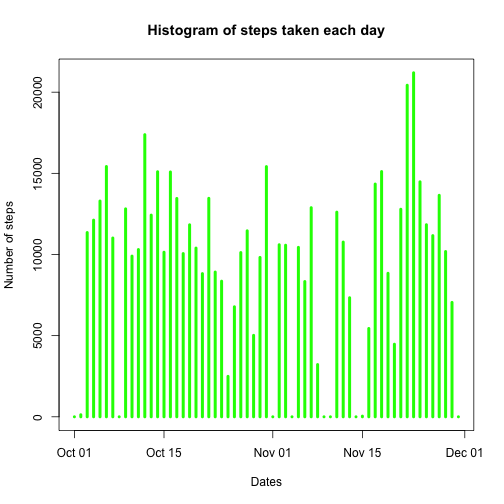
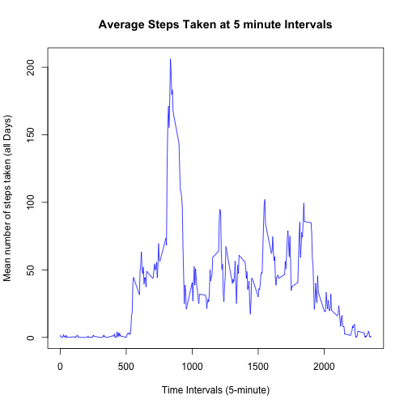
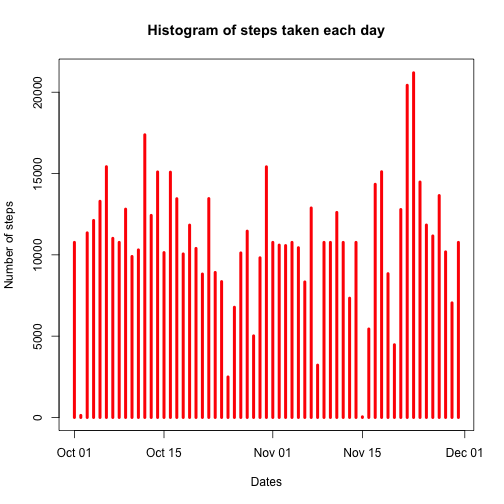
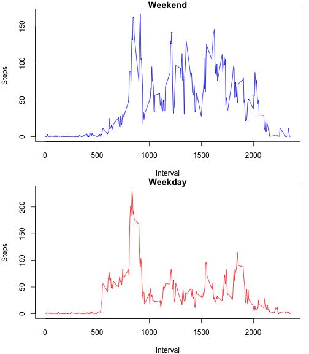

# Reproducible Research: Peer Assessment 1
Loading a few libraries:

```r
library(plyr)
library(dplyr)
library(lattice)
library(data.table)
```

## Loading and preprocessing the data
Load the **activity.csv** file and convert the dates to Date class:

```r
activityDataset <- read.csv(file = "activity.csv", header = TRUE, sep = ",")
activityDataset$date <- as.Date(activityDataset$date, "%Y-%m-%d")
```

## What is mean total number of steps taken per day?
1. Calculate the sum aggregation of steps taken by day, ignoring NAs
2. Plot the histogram based on the previous aggregation
3. Calculate and report the mean and median of the total number of steps taken per day. In this part, the aggregation was reprocessed with NAs so they are discarded inside mean() and median() functions.

```r
totalStepsPerDay <- with(activityDataset, aggregate(steps, by = list(date), sum, na.rm=TRUE))
plot(totalStepsPerDay, type="h", main="Histogram of steps taken each day", xlab="Dates", ylab="Number of steps", lwd=4, col="green")
```



```r
totalStepsPerDay <- with(activityDataset, aggregate(steps, by = list(date), sum))
names(totalStepsPerDay) <- c("date", "totalSteps")
mean(totalStepsPerDay$totalSteps, na.rm=TRUE)
```

```
## [1] 10766.19
```

```r
median(totalStepsPerDay$totalSteps, na.rm=TRUE)
```

```
## [1] 10765
```


## What is the average daily activity pattern?
1. Aggregate the total steps taken by 5 minute interval.
2. Plot the time series plot
3. Which 5-minute interval, on average across all the days in the dataset, contains the maximum number of steps?

Performs the mean aggregation given 5-minute interval

```r
avgTotalStepsPerInterval <- with(activityDataset, aggregate(steps, by = list(interval), mean, na.rm=TRUE))
plot(avgTotalStepsPerInterval, type="l", main="Average Steps Taken at 5 minute Intervals", xlab="Time Intervals (5-minute)", ylab="Mean number of steps taken (all Days)", col="blue")
```



Finds out which interval has the maximum average value

```r
names(avgTotalStepsPerInterval) <- c("interval", "avgSteps")
maxAvgIndex <- which.max(avgTotalStepsPerInterval$avgSteps)
avgTotalStepsPerInterval[maxAvgIndex,]$interval
```

```
## [1] 835
```

## Imputing missing values
1. Calculate and report the total number of missing values in the dataset (i.e. the total number of rows with 𝙽𝙰s)
2. Devise a strategy for filling in all of the missing values in the dataset.
3. Create a new dataset that is equal to the original dataset but with the missing data filled
4. Make a histogram of the total number of steps taken each day and Calculate and report the mean and median total number of steps taken per day.

Calculate and report the total number of NA values:

```r
missingValsQty <- sum(is.na(activityDataset))
missingValsQty
```

```
## [1] 2304
```

Devise a strategy for filling in all of the missing values in the dataset.

```r
missingValueIndices <- which(is.na(activityDataset))
for(i in missingValueIndices) {
    activityDataset$steps[i] = avgTotalStepsPerInterval[avgTotalStepsPerInterval$interval == activityDataset[i, 3], 2]
}
sum(is.na(activityDataset))
```

```
## [1] 0
```

```r
totalStepsPerDay <- with(activityDataset, aggregate(steps, by = list(date), sum, na.rm=TRUE))
plot(totalStepsPerDay, type="h", main="Histogram of steps taken each day", xlab="Dates", ylab="Number of steps", lwd=4, col="red")
```



## Are there differences in activity patterns between weekdays and weekends?
1. Using weekdays() function, classifies each record either 'weekday' or 'weekend'.
2. Aggregate the average of steps taken by 5-minute interval and weekday and weekend.
3. Plot the time series.

Create the factor levels:

```r
days <- weekdays(activityDataset$date)
activityDataset$day_type <- ifelse(days == "Saturday" | days == "Sunday", "weekend", "weekday")
```
Calculdate the aggregation:

```r
avgTotalStepsPerIntervalDayType <- with(activityDataset, aggregate(steps, by = list(interval, day_type), mean))
names(avgTotalStepsPerIntervalDayType) <- c("interval","day_type","steps")
avgWeekend <- subset(avgTotalStepsPerIntervalDayType, day_type == "weekend")
avgWeekend <- subset(avgWeekend, select = -c(day_type))
avgWeekday <- subset(avgTotalStepsPerIntervalDayType, day_type == "weekday")
avgWeekday <- subset(avgWeekday, select = -c(day_type))
```

Plot the time series:

```r
par(mfrow = c(2, 1), mar = c(4, 4, 1, 1), oma = c(0, 0, 0, 0))
plot(avgWeekend$interval, avgWeekend$steps, type="l", xlab = "Interval", ylab = "Steps", main="Weekend", col= "blue")
plot(avgWeekday$interval, avgWeekday$steps, type="l", xlab = "Interval", ylab = "Steps", main="Weekday", col="red")
```


